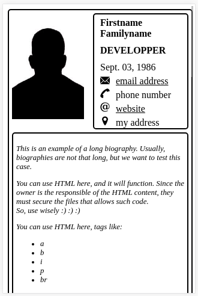
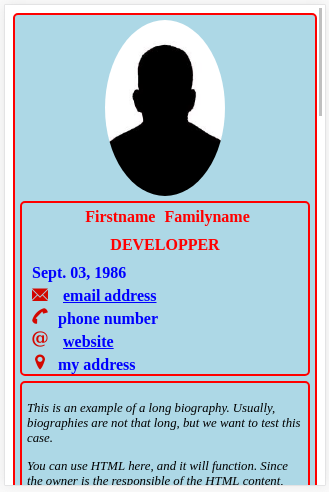
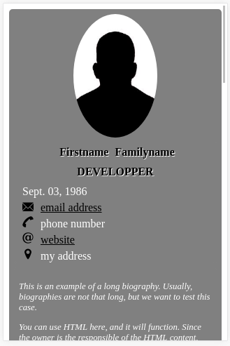
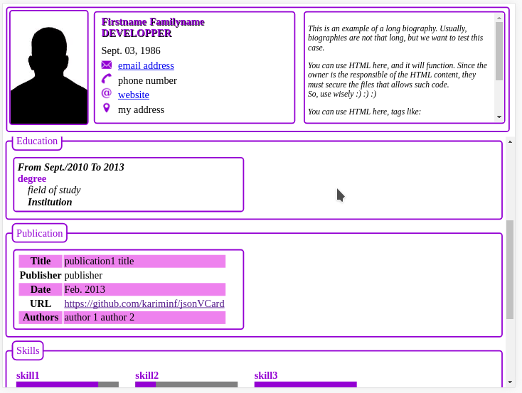

# cv.json

[](https://nodei.co/npm/cv.json/)

[](https://kariminf.github.io/cv.json/)
[](http://www.apache.org/licenses/LICENSE-2.0)
[](https://www.npmjs.com/package/cv.json)
[](https://travis-ci.org/kariminf/cv.json)
[](https://www.npmjs.com/package/cv.json)

TL;DR: Create your Curriculum Vitae (CV) personal webpage by putting your information on a json file and an almost blank index.html (containing just information about themes)

** Long Version **

When you want to create a personal CV website, you have to put your information into a static HTML file (if you don't want a server based one).
Then, if you want to change the design, sometimes changing CSS is not enough; you have to change HTML too.
So, this project is meant to:
* Create a CV webpage without needing to configure servers (front-end).
* Facilitate the update of informations without breaking the page's structure, by separating personal information and page design.
* Make it easy to select and create themes.

Technically speaking:
* Create a client side CV webpage.
* Separate information and design.
* Create many themes.

As consequences:
* The application can be hosted widely and doesn't need any special server configuration
* The page is built locally and dynamically in the user's side
* The themes can be changed easily without
* Most importantly, the user doesn't have to program anything

In other word:
* I can give you a pie, but instead I give you all the ingredients (json file, html files, template, css) and the recipe (jsonvcard.js) and you cook it yourself

## Showcasing









For an exhaustive list of available themes, [check THIS](./THEMES.md)

## How it works

The HTML file doesn't contain anything at all. It just calls for the script which will do the calls.


1. The browser will download the index file
1. Then, it downloads the script
1. The script will download the css specified in the index file and apply it to the document
1. It will download the template into a shared string
1. The script will then merge the template and the information in the json file
1. If there are some files, the script will download them asynchronously
1. When the script receive response from a file it will merge its content into the template
1. Finally, when all the wanted files has responded, the script pushed the merged content into the body of the page

Check [the API](https://kariminf.github.io/cv.json/docs/docs)

## How to use

### Download from Github

* Download the last release [HERE](https://github.com/kariminf/cv.json/releases/latest)
* Extract the files in your project
* Modify index.html (include theme, style)
* Modify cv.json (insert your information)

### Download from Npm

In your project tree, tape this command line to download the latest version to "node_modules":
```bash
npm i cv.json
node node_modules/cv.json/install.js
```
All needed files will be copied to the root (where the shell is positioned)
* Modify index.html
* Modify cv.json

If you want to test your webpage locally, install a simple HTTP server
```bash
npm i http-server -D
```
Then,
```bash
node_modules/http-server/bin/http-server ./ -p 8090
```
Open this address on your browser:
```bash
node_modules/http-server/bin/http-server ./ -p 8090
```

### HTML file

By introducing information inside a json file ("cv.json"), you can generate a CV webpage (resumé).
This can be done using javascript ("cv.json.js") which is called as follows:
```html
<html>
<head>
  <meta charset="UTF-8">
  <title>Test CV</title>
  <meta name="viewport" content="width=device-width, initial-scale=1">
  <script type="text/javascript" src="<link/to/cv.json.js>" ></script>
</head>
<body>
  <script>
    JsonVCard.setStyleName("violet")
      .setRelativePath("link/to/current/directory") /*where your profile picture and helper files are*/
      .setThemesPath("link/to/the/theme")/*Not affected by setRelativePath*/
      .setThemeName("theme-name")/*must come after setThemesPath*/
      .setFooter("link/to/footer.htm") /*Not affected by setRelativePath*/
      .process("link/to/cv.json");/*Not affected by setRelativePath*/
  </script>
</body>
</html>
```
The json file ("vcard.json") contains information about the one for whom we want to generate a CV.
it is self explanatory and easy to fill.

For API documentation, check [this YuiDoc generated documentation](https://kariminf.github.io/cv.json/docs/docs/)


Also, if you just want to update the package, don't execute the last instruction.
Otherwise, it will overwrite your json file (if its name is not cv.json)

## Community

All the C's are here:

* [CODE_OF_CONDUCT](./CONTRIBUTING.md) : How to contribute to this project
* [CODE_OF_CONDUCT.md](./CODE_OF_CONDUCT.md) : Some recommendations must be followed for a healthy development environment.
* Changelog: [CHANGELOG.md](./CHANGELOG.md) : Changes in every version
* Credits: [CREDITS.md](./CREDITS.md) : List of contributors

## License

Copyright (C) 2016-2018 Abdelkrime Aries

Licensed under the Apache License, Version 2.0 (the "License");
you may not use this file except in compliance with the License.
You may obtain a copy of the License at

http://www.apache.org/licenses/LICENSE-2.0

Unless required by applicable law or agreed to in writing, software
distributed under the License is distributed on an "AS IS" BASIS,
WITHOUT WARRANTIES OR CONDITIONS OF ANY KIND, either express or implied.
See the License for the specific language governing permissions and
limitations under the License.
