# List of themes

## default
Its code is:
```
.setThemeName("default")
```
or don't affect any theme name since it is the default one

### violet
```
.setStyleName("violet")
```
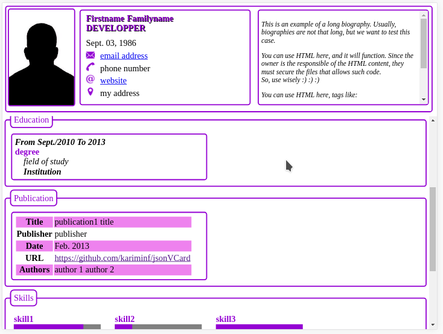


### black
```
.setStyleName("black")
```
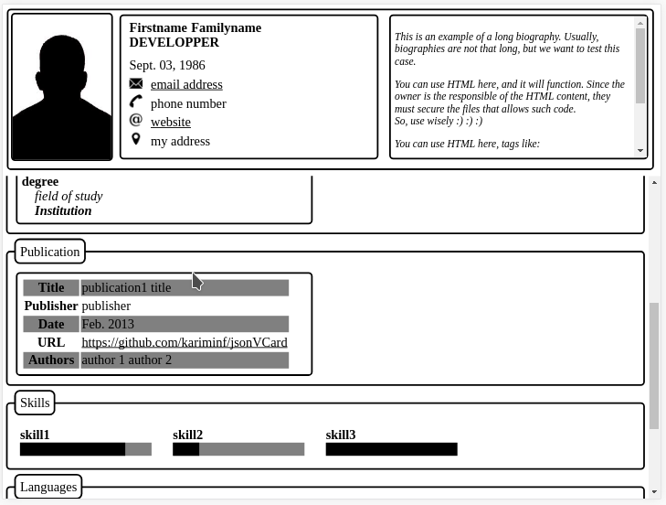


### vertical
```
.setStyleName("vertical")
```
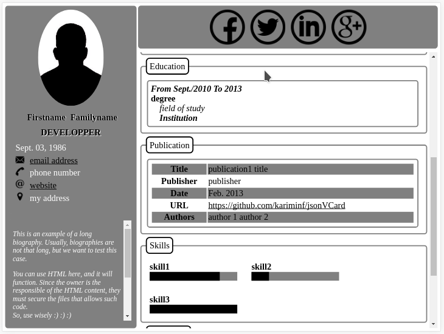
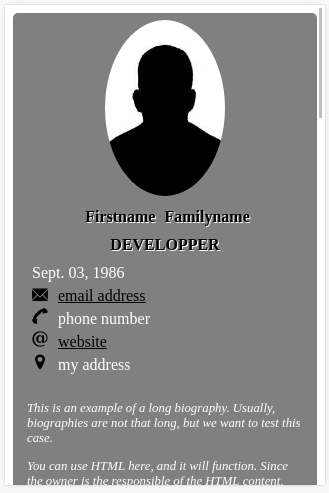

### colorful
```
.setStyleName("colorful")
```
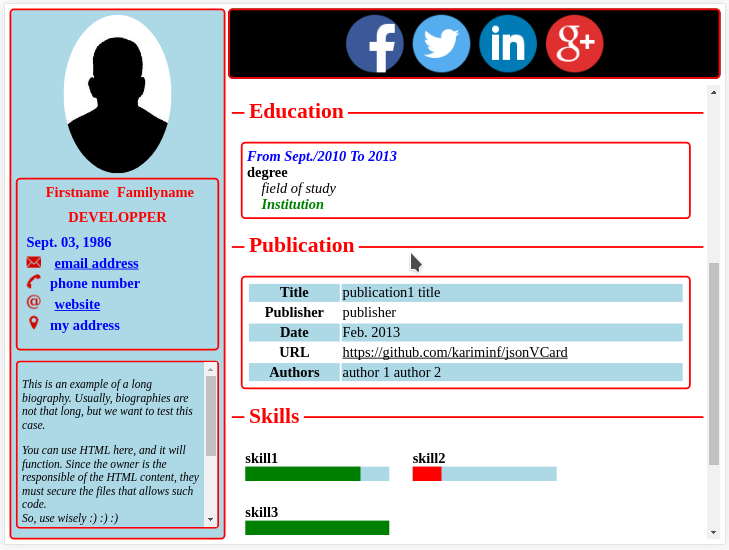
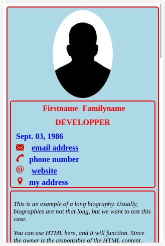

## title_first
Its code is:
```
.setThemeName("title_first")
```

### violet
```
.setStyleName("violet")
```
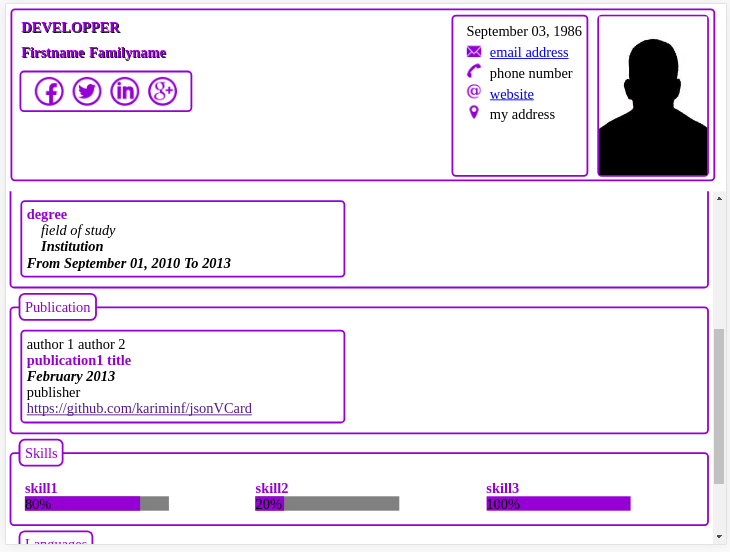
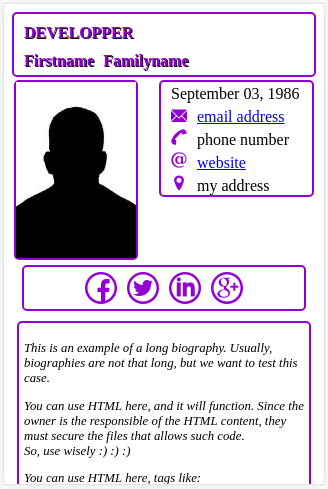

### black
```
.setStyleName("black")
```
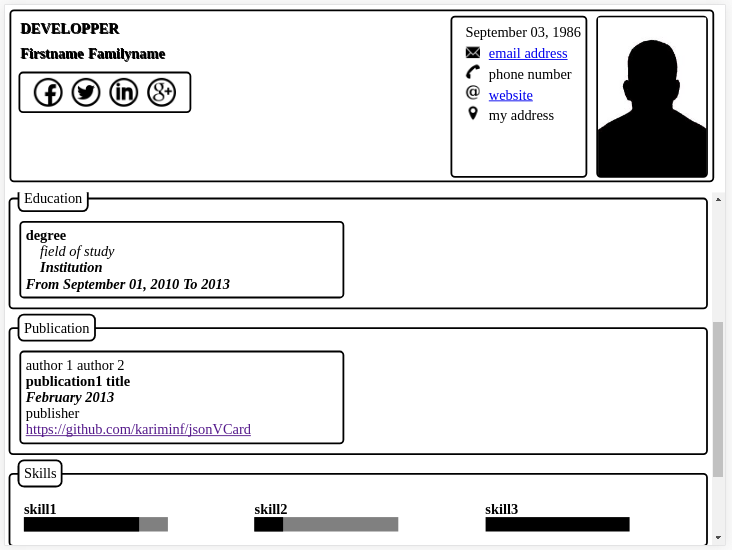
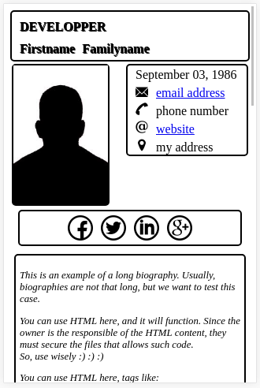

### vertical
```
.setStyleName("vertical")
```
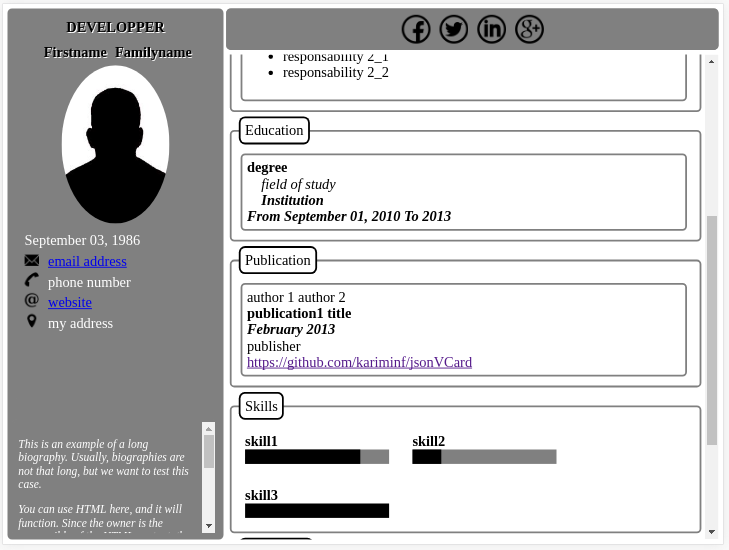
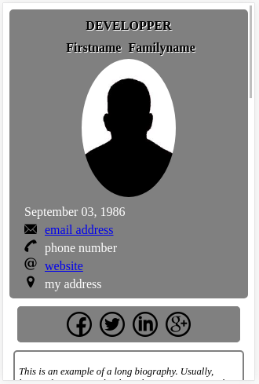

### colorful
```
.setStyleName("colorful")
```
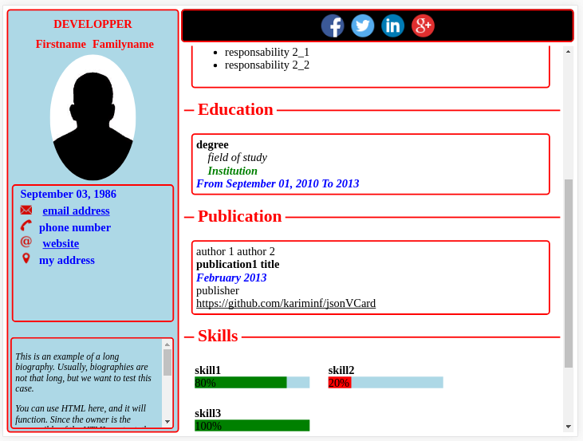
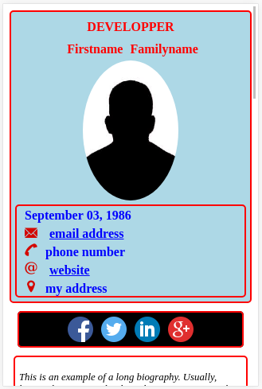

### dark
```
.setStyleName("dark")
```
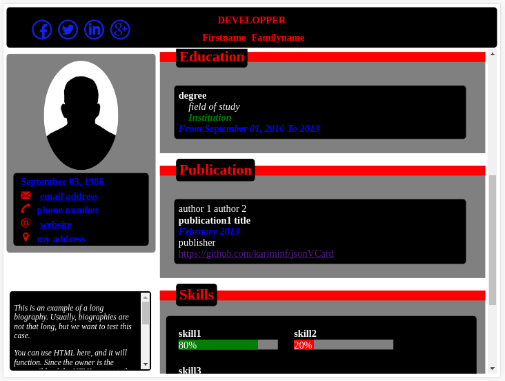
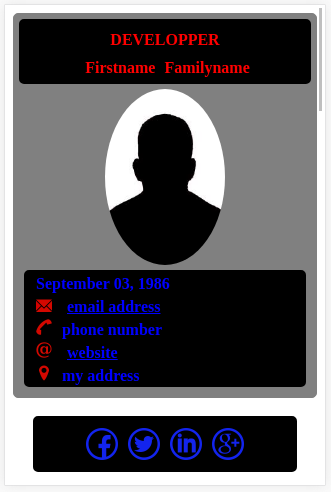
