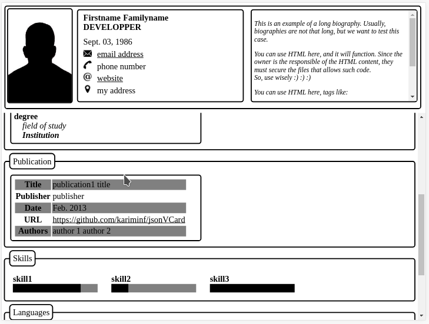
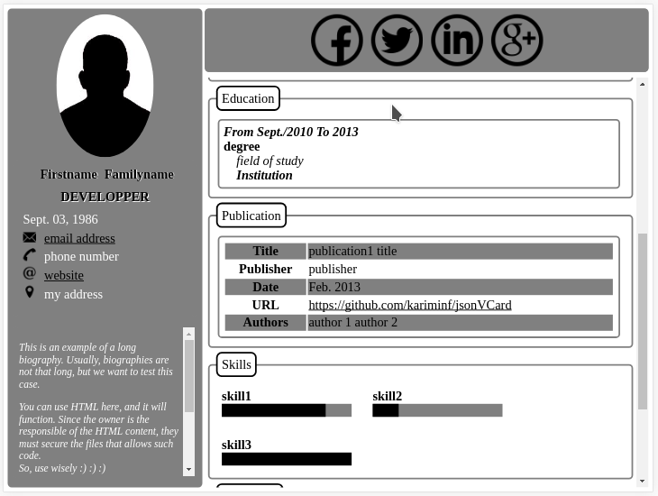

# List of themes

## default
Its code is:
```
.setThemeName("default")
```
or don't affect any theme name since it is the default one

### violet
```
.setStyleName("violet")
```


### black
```
.setStyleName("black")
```


### vertical
```
.setStyleName("vertical")
```


### colorful
```
.setStyleName("colorful")
```

